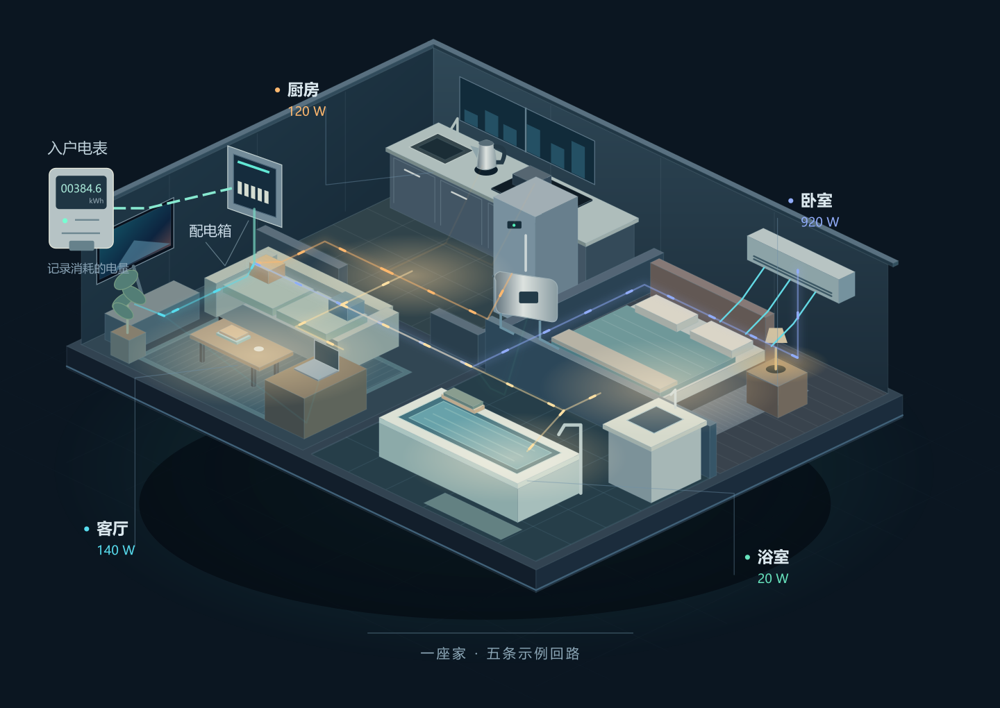

# 家庭电力实验室

一座可以操作的立体住宅，帮助普通住户理解家庭用电组件、关键名词、保护原理与布电需求。通过开关电器、追踪回路和观察故障建立直觉，必要说明随当前场景出现。



## 打开体验

| 入口 | 用途 |
| --- | --- |
| [一眼看懂家庭用电.html](一眼看懂家庭用电.html) | 完整交互展览，包含四个展区与资料图鉴 |
| [家庭用电全景拓扑图.html](家庭用电全景拓扑图.html) | 更紧凑的全景展台，保留原文件名以兼容已有链接 |
| [src/](src/) | 可维护的图形、样式、交互模型、构建器和验证脚本 |

两份 HTML 都可离线运行，没有外部脚本、字体或图片依赖。下载后放在同一目录，使用现代浏览器打开。GitHub 的源码预览不运行 HTML 交互。图片是房屋 SVG 场景的静态预览，不是整页浏览器截图。

## 四个展区

1. **点亮这座家**：厨房、客厅、卧室、浴室的立体剖面；8 组电器、5 条示例回路；设备灯光、能量流、总功率与模拟开关联动。断开某个分路后，其设备失电，操作意图仍被保留，合闸后可以恢复。
2. **保护实验**：过载、短路、漏电、接触不良，均有“正常—异常—结果”三个阶段。可自动播放，也可以逐步观察；切出实验会恢复原有总闸和分路状态。接触不良实验特意保留“不一定跳闸”的结果。
3. **电的语言**：可开合的交流工作回路与火零地聚焦；功率、电流、电量和电费的联动仪表；MCB、RCCB、RCBO 的功能剖解及剩余电流实验。
4. **为家布电**：在同一户型里高亮不同回路，理解房间与回路并非一一对应，并整理设备、位置、功率、同时使用与现场核查需求。

另有可搜索的 20 项名词、完整供电路径、异常处置与专业资料来源。外部资料和页间链接使用新标签页打开。

## 模型范围

- 以中国大陆普通住宅单相供电为例。设备功率、分路与故障条件都是教学示例，不是现场测量或施工设计。
- 房屋中的流动亮点表示能量传递关系；交流电荷的往复运动在独立原理展品中演示，并大幅放慢。
- 故障播放时间只服务于阅读，不代表保护器真实动作时间。保护的结果受故障条件、产品类型与保护配合影响。
- 电流按功率因数 1 估算；电费按用户输入的单一电价估算，未包含阶梯、峰谷等条件。
- 支持键盘操作、触屏按钮、暂停动效、减少动态效果偏好与窄屏布局。图中的小热点在手机上由下方的大按钮提供等效操作。

## 维护

使用 Python 标准库生成两份独立 HTML：

```sh
python src/build.py
node --test src/model.test.cjs
python src/verify.py
```

`src/dom.test.cjs` 使用 LinkeDOM 执行生成页面里的真实事件逻辑，可在提供该依赖的环境运行。源文件职责和验证边界见 [src/README.md](src/README.md)。旧版框线拓扑的规格文件已随重构移除，历史版本仍保留在 Git 中。
